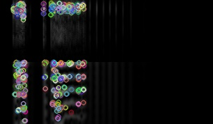
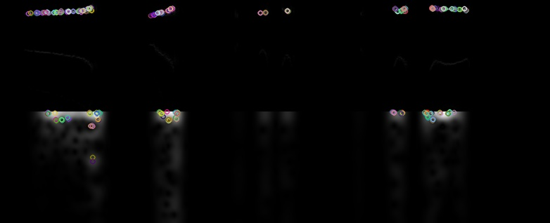
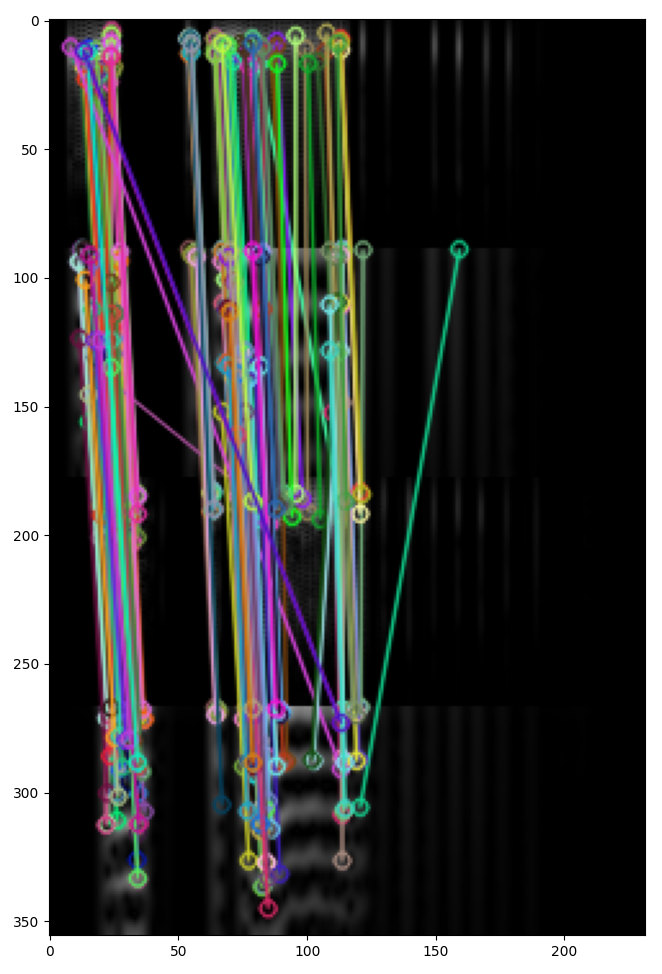
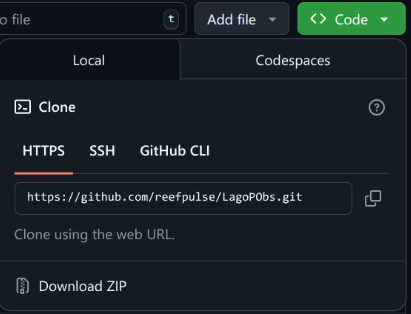
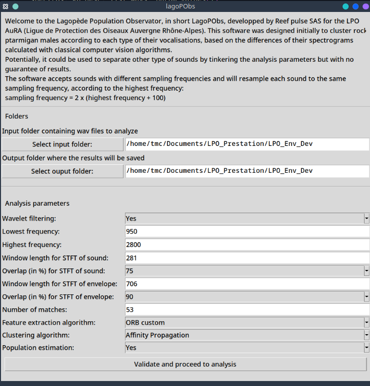

# LagoPObs: Lagopède Population Observator

This code is © T. Marin-Cudraz, REEF PULSE S.A.S, LPO AuRA, 2025, and it is made available under the MIT license enclosed with the software.  As this license is not very restrictive, we invite you to use, share and modify the software and its codes.

Over and above the legal restrictions imposed by this license, if you use this software for an academic publication then please provide proper attribution. This can be to this code directly:

T. Marin-Cudraz, Y. Bayle, S. Elise, B. Drillat. LagoPObs: Lagopède Population Observator, a software to separate male ptarmigans indivuals from their sounds (2025). github.com/XXXXX.

# Purpose of the software

The purpose of this software and its code is to separate and group animal sounds. It was initially made to estimate populations of rock ptarmigan (*Lagopus muta*) via long-term recordings, but can potentially be generalized to:
- Test the separation of a bioacoustics dataset into several types of sounds/songs/vocalizations.
- Be a first separation step in an automatic signal separation/recognition pipeline.
- Test the separation of animal populations via their sounds.
- Test the individual signature carried by signals.
- Estimate a number of individuals in a population.

This software has several advantages: it's relatively fast (around ten seconds for 100 files), it doesn't need a learning phase compared to machine learning, and it is presented as stand-alone executables (for Windows 10/11 and Linux), with a simple interface. A demonstration script is given for those wishing to play and modify the underlying code. However, a calibration phase is required to enhance the software performance, depending on the type of signal and the results expected.

# Technical description

Sound separation is based on the results of a STFT (Short-Time Fourier Transform) and an envelope STFT. Each STFT / envelope STFT envelope combination is compared with the others via computer vision algorithms, feature matching (in the exemples below, an ORB [1-2]). They search for keypoints in these spectrograms and extract descriptors of local spectrogram features around these keypoints. Two examples are given below, a vocalization of a rock ptarmigan (Fig.1) and a song of a hazel grouse (*Tetrastes bonasia*, Fig.2). In both cases, the images analyzed by feature matching consist of two sound spectrograms, cut at the frequencies of interest: at the top, the STFTs of the filtered and cleaned sound (see below for filtering) and at the bottom, the spectrogram of the envelope of the filtered and cleaned sound. Note that the origin of each STFT is at the top left, so the frequency axis is inverted compared with a conventional STFT display. The colored dots are the keypoints identified by the feature matching algorithm. We can see that the algorithm identify the characteristics of the image well, whether for species with highly rhythmic, pulse-based vocal production like the ptarmigan, or based on frequency modulation like the grouse.

||
|:--:|
|Figure 1: Image corresponding to a rock ptarmigan vocalization (*rock_ptarmigan_1.wav* from the *Examples* folder) with its keypoints as colored dots. On top, the STFT of the filtered and resampled sound (new sampling frequency: 5800 Hz), for frequencies between 950 and 2800 Hz. STFT characteristics: Hamming window, size 281, overlap: 75%. Below, STFT of the envelope, for frequencies between 0 and 160 Hz. STFT envelope characteristics: Hamming window, size 706, overlap: 90%. Sound source: Thibaut Marin-Cudraz, Frédéric Sèbe, [3-4].|

||
|:--:|
|Figure 2: Image corresponding to a hazel grouse song (*XC361691_Gelinotte_des_bois_1.wav* from the *Examples* folder) with its keypoints as colored dots. On top, the STFT of the filtered and resampled sound (new sampling frequency: 32200 Hz), for frequencies between 6000 and 16000 Hz. STFT characteristics: Hamming window, size: 512, overlap: 75%. Below, STFT of the envelope, for frequencies between 0 and 160 Hz. STFT envelope characteristics: Hamming window, size 4096, overlap: 90%. Sound source: https://xeno-canto.org/361691, Benjamin Drillat.|


Once the keypoints and descriptors have been extracted, a matcher (in this case a Brute force matcher [5-6]) is used to match the descriptors of two images, identifying descriptors with similar characteristics (Fig.3). Based on the matches, an average distance is calculated between two images, the smaller the distance, the more similar the descriptors of the two images. A matrix composed of the distances calculated between each pair of images is then computed and injected into a clustering algorithm to separate the sounds into homogeneous groups. Some types of sound, such as ptarmigan vocalizations, have subtle inter-individual differences. To increase inter-individual differences and facilitate their separation, the software lets the clustering algorithms calculate the Euclidean distance between each pair of sounds based on the inter-image distance matrix. The clustering results are saved in a CSV file (*clustering_results.csv*) and the images with their keypoints (as shown in Figure 1 and 2) are exported and saved.

||
|:--:|
|Figure 3: Example of matching between two images corresponding to two different rock ptarmigan vocalizations (*rock_ptarmigan_1.wav* and *rock_ptarmigan_2.wav* from the *Examples* folder supplied with the software and generated with the draw_matches_example.py script from the same folder). We can see that the matcher has made a few approximations, for example the match on the far right in green connects two points that have similar characteristics locally but are not really identical. To avoid including these approximations, the software filter the matches (see below for details).|

If the user wishes to obtain additional information and have a population estimate based on the clustering results, then further calculations are performed. The following calculations are made assuming that:

- The sounds are taken from long-term acoustic monitoring, with several days of recordings.
- The name of each file is composed of different parts separated by an underscore (“_”) and contains its recording date in the format “yearmonthday” in the second position. For example, "xxxxx_20230619_xxxxxx.wav" indicates that the file was recorded on June 19, 2023.

Based on the recording date and cluster assignment of each file, the software calculates the number of sounds and clusters per day (saved in the file *number_of_clusters_per_day.csv*), the number of sounds per cluster per day (saved in the file *number_of_sounds_per_cluster_per_date.csv*). Using this data, a presence index (PI, saved in *presence_index.csv*), defined in [4], is calculated for each cluster $k$ (1) :

$$PI_k = \frac{N_{sounds}(k)}{N_{sounds}(total)} \times \frac{N_{days}(k)}{N_{days}(total)}  \qquad(1)$$

With $N_{sounds}(k)$, the number of sounds assigned to the cluster $k$ ; $N_{sounds}(total)$, the total number of sounds in the dataset; $N_{days}(k)$, the number of days on which $k$ is present, $N_{total}(k)$, the total number of days, i.e. the duration of the study in days.

A presence index of 0.01 was used in [4] to estimate the number of male ptarmigan regularly present in the study area. This threshold has been retained here (not modifiable using the interface, but it is possible to modify in the code, see *demo_script.py*). Using this threshold allows us to estimate the number of clusters regularly present in the study.

Some individuals or groups may be divided into several clusters because their vocalizations or songs evolve over the course of the study. This is particularly true of stereotyped sound emissions and birds learning constantly. In the first example, the variability of which is based mainly on the genetics and physiological condition of the individual transmitter. The sounds emitted by an individual can thus vary according to weather or food availability. In the second example, individuals incorporates new patterns in their repertoire. In addition, certain individuals may be present only sporadically or are just passing by. Finally, the same sounds may be split in different clusters due to noise: if the software is configured to detect very fine differences, then the slightest noise present may interfere with correct grouping. As a result, the total number of clusters found in the analysis may be an overestimate of the population. The total size of the population can then be estimated via a generalization of the presence index and an information criterion inspired by the AIC (Akaike Information Criterion, [7-8]).

We can generalize the cluster population presence index to the PPI (Presence Population Index) (2) :

$$PPI_n = \frac{\sum_{k}^{n} N_{sounds}(k)}{N_{sounds}(total)} \times \frac{\bigcup_{k}^{n}N_{days}(k)}{N_{days}(total)}  \qquad(2)$$

$PPI_n$ is the PPI for a population of $n$ clusters; $\sum_{k}^{n} N_{sounds}(k)$, the sum of the number of sounds from the $n$ clusters in the population; $N_{sounds}(total)$, the total number of sounds in the dataset; $\bigcup_{k}^{n}N_{days}(k)$, the number of days on which at least one of the clusters in the population is present; $N_{days}(total)$, the number of days in total, i.e. the duration of the study in days. The PPI is calculated for populations ranging from 1 to the total number of clusters found.  Clusters are gradually included in populations according to their presence in the dataset, in descending order of PI: the population containing $n$ individuals will contain the $n$ individuals with the highest PI.

The PPI can be seen as an approximation of the probability that the $n$ clusters in the population represent the data, and is therefore an estimate of the real number of individuals: the more clusters are added to the population, the closer the PPI is to 1. This PPI must therefore be balanced against the risk of overestimating the number of individuals present in the real population. The AIC (3), or Akaike Information Criterion [7-8], measures the quality of a statistical model by balancing the explanatory power of the model, the natural logarithm of its likelihood $\log(L)$ and $n$, the number of parameters in a statistical model:

$$AIC = 2 \times n - 2 \times \ln(L) \qquad (3)$$

Based on this equation, we define the Population Information Criterion (4) or PIC for an estimated population of $n$ clusters as a function of $N$, the total number of clusters found by clustering and $PPI_n$, the PPI of an estimated population of $n$ clusters :

$$PIC_n = 2 \times \frac{n}{N} - 2 \times \log(1+ PPI_n) \qquad (4)$$

1 is added to the PPI to make the logarithm positive, and $n$ divided by to give a ratio ranging from 0 to 1, just like the PPI. Thus, PPI and PIC will have roughly the same influence on the PIC value. The PIC therefore balances the number of clusters in the population with the probability that these $n$ clusters are representative of the real population. The ideal number of clusters is therefore estimated by minimizing the PIC: the $n$ with the smallest PIC represents the estimate of the total number of individuals in the population.

The PIC and PPI values are stored and saved in the CSV file *PPI_PIC.csv*.

The software therefore gives two estimates: the number of resident individuals based on the Presence Index, and the total population based on the Population Information Criterion. These estimates are based on relatively simple calculations, but are sufficient for the purpose needed here. The results saved by the software can be used to perform further, more complex analyses of population dynamics (capture-marking-acoustic recapture, ...) if necessary.


# Installation

The software is available as executables (generated using pyinstaller [9]) for Windows (only tested on Windows 11) and Linux that requires no dependencies. macOS users can still execute the python code (see below) but will need the installation of Python and the libraries.

If you want to execute the python code, you need to install these libraries:

- With pip:

```
pip install numpy scipy scikit-image scikit-learn matplotlib soxr pywavelets pandas opencv-python
```
- With conda:
```
conda install numpy scipy scikit-image scikit-learn matplotlib soxr pywavelets pandas opencv-python
```
To get the software and the python codes, you can clone the repo with git by typing in the terminal:

```
git clone https://github.com/XXXX
```

You can also download the repo as a ZIP file using the *Code* button and clicking on *Download ZIP* (Fig.4). The software and the codes will be available in the downloaded ZIP file.


||
|:--:|
|Figure 4: Download the GitHub repo in ZIP format.|


# Running the software

## Using executables

No need to install the libraries if you are using the executables.
- For Windows users: clone/download this repo, unzip and go to the folder and double-click on *LagoPObs_windows.exe*. The software may take a few seconds to open.

- For Linux users: clone/download, unzip this repo and go to the folder. Double-click on *LagoPObs_linux*. If the application does not start, then make it executable using the terminal:
    ```
    chmod +x LagoPobs_linux
    ```
    Then you should be able to execute it by double-clicking or using a terminal:
    ```
    .\LagoPobs_linux
    ```

## Executing the python code

The code was tested for Python 3.9, 3.11, 3.12 and 3.13. There should be no problems with 3.10. The only strict requirement is to have a version of scikit-learn that is 1.3 or higher (inclusion of HDBSCAN).
Install the required libraries with *pip* or *conda*.
You will need to clone/download this repo, unzip and go to the folder.
If you want to use the GUI (Graphical User Interface), open a terminal and type:
```
python LagPObs.py
```

If you just want to study and use the underlining code of the analysis without the GUI, e.g. to use it in a pipeline or to test for different configuration at the same time, open and use the *demo_script.py* file.


# Interface description

The GUI is simple with only a few buttons and fields:



To change the folders where the sounds are located, press *Select input folder*, to change the directory where the results will be saved, press *Select output folder*. By default, the location of the program is used. The input folder can have other type of files than WAV inside, it will automatically filter out non-WAV files. It accepts multiple sample rate and bitrate as the sounds will be automatically converted to 64 bits arrays and will be resampled.

Below, you have access to the different analysis parameters. By default, all parameters are set so that the software can discriminate between rock ptarmigan males.

The *Wavelet filtering* option allow to activate/desactivate the option for the software to perform a wavelet denoising scheme based on the stationary wavelet transform (i.e. the "algorithme à trous", see PyWavelets [1] and [2]) using a biorthogonal wavelet. The wavelet cannot be modified at the moment without going into the code, but it should work for a wide range of signals. The sound is first resampled (see below) and bandpass filtered between the lowest and highest filtering, then it is decomposed using the stationary wavelet transform in several levels. For each level, Fisher's kurtosis is calculated and the level is set to 0s if the kurtosis is negative. Then, a soft thresholding is applied using the standard deviation of each particular level as the threshold. The signal is then reconstructed using the modified levels.

The lowest and highest frequency set the frequency bandwidth of the bandpass filtering (an order 10 butterworth filter). The *Highest frequency* parameter is really important as it will also conditioned the new sampling rate at which the sounds will be resampled using the formula:

$$new sampling rate = 2 \times (Highest frequency + 100)$$


100 is added to avoid frequency aliasing at some frequencies of interest. The choice of the *Highest frequency* is thus critical. It also implies that the temporal resolution of your spectrograms will be modified so be sure to check that the window lengths are still appropriate when modifying this parameter.

The characteristics of the spectrograms of the filtered signal and its envelope can be configured using the next 4 parameters: *Window length* and *Overlap* of STFT (Short-Time Fourier Transform) of sound for the spectrogram of the filtered signal and *Window length* and *Overlap* of the STFT for the spectrogram of the envelope. A hamming window is used for both spectrograms and cannot be modified using the interface.

The *Feature extraction algorithm* parameter configures the feature extraction and matching. The goal of those algorithms is to detect critical keypoints in the image that best describe the features of the image. Each keypoint comes with a descriptor, that represents the local characteristics of the image around the keypoint. You can choose a list of classical algorithms taken from OpenCV: ORB [3], Custom ORB is ORB but with parameters tuned specifically for spectrograms of Rock ptarmigan, SIFT [4-5], AKAZE [6], KAZE [7]. ORB or Custom ORB should work fine for most applications and are also the fastest. After the extraction of the keypoints and descriptors


# References

[1] Rublee, E., Rabaud, V., Konolige, K., & Bradski, G. (2011, November). ORB: An efficient alternative to SIFT or SURF. In 2011 International conference on computer vision (pp. 2564-2571). Ieee.

[2] https://docs.opencv.org/4.x/d1/d89/tutorial_py_orb.html

[1] Lee, G., Gommers, R., Waselewski, F., Wohlfahrt, K., & O'Leary, A. (2019). PyWavelets: A Python package for wavelet analysis. Journal of Open Source Software, 4(36), 1237.

[2] https://en.wikipedia.org/wiki/Stationary_wavelet_transform

[3] Rublee, E., Rabaud, V., Konolige, K., & Bradski, G. (2011, November). ORB: An efficient alternative to SIFT or SURF. In 2011 International conference on computer vision (pp. 2564-2571). Ieee.

[3] https://docs.opencv.org/4.x/d1/d89/tutorial_py_orb.html

[4] Lowe, D. G. (2004). Distinctive image features from scale-invariant keypoints. International journal of computer vision, 60, 91-110.

[5] https://docs.opencv.org/4.x/da/df5/tutorial_py_sift_intro.html

[6] https://docs.opencv.org/3.4/db/d70/tutorial_akaze_matching.html

[7] https://docs.opencv.org/4.x/d3/d61/classcv_1_1KAZE.html
